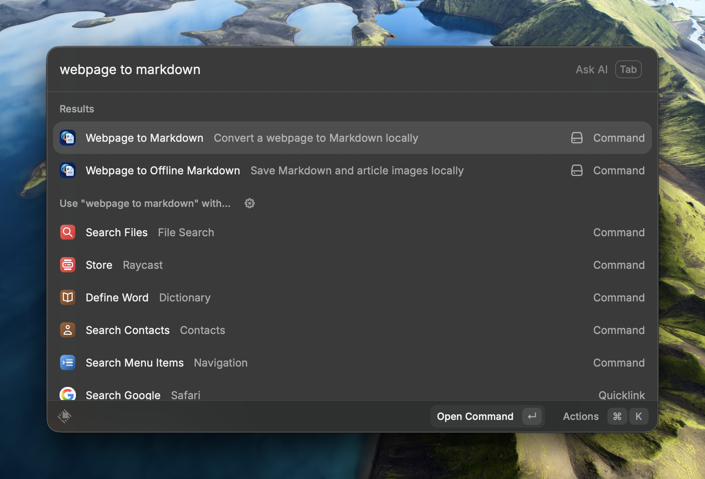
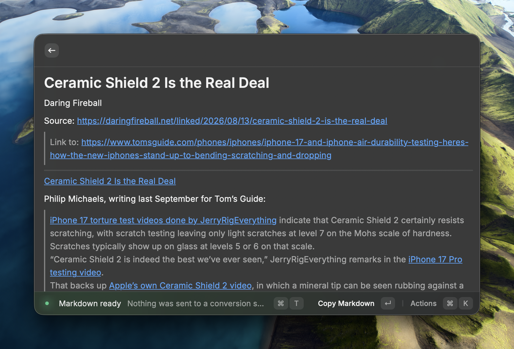
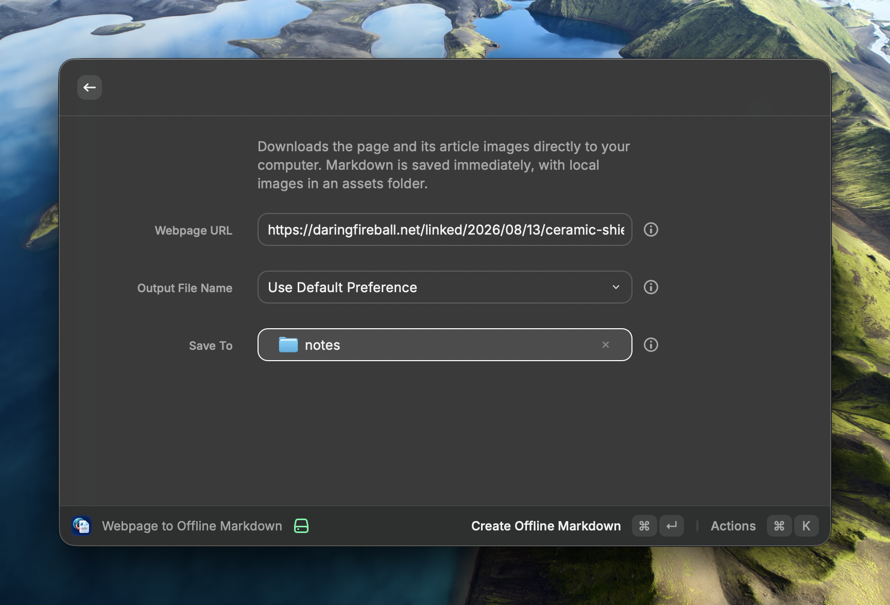

<p align="center">
  
</p>

# Webpage to Markdown for Raycast

Turn a webpage into clean Markdown on your computer. The extension fetches the page from your Mac, extracts readable content, and converts it locally - no AI or cloud conversion service receives the page contents.

<p align="center">
  
</p>

## What it does

- **Webpage to Markdown** converts a URL to Markdown for previewing, copying, saving, or opening in your preferred apps.
- **Webpage to Offline Markdown** saves a portable Markdown export and downloads article images for local use.
- **Current Safari Page to Markdown** reads the active Safari tab's rendered page, including a signed-in session, and converts it locally.
- Choose a generated filename style or enter a **Custom File Name**. The `.md` extension is optional and is never duplicated.
- Choose a destination for each export, or configure a default folder once in Raycast preferences.

## Install and run

Install [Raycast](https://www.raycast.com/) and Node.js, then use one of the helpers in this repository:

```sh
# Start in development mode; Raycast reloads source changes automatically.
./dev_install_extension.sh

# Build and install without development-mode reloading.
./install_extension.sh
```

For manual setup, configuration, and development commands, see the [extension documentation](./webpage-to-markdown-local/README.md).

## Convert a webpage

1. Open **Webpage to Markdown** in Raycast and enter an `http` or `https` URL.

<p align="center">
  
</p>

2. Choose an output filename format, optionally supply a custom filename, and choose a destination when you want one for this run.

3. Review the generated Markdown, then copy it, save it, reveal it in Finder, or open it in a configured text editor or Markdown viewer.

<p align="center">
  
</p>

## Create an offline export

**Webpage to Offline Markdown** writes the export immediately. It downloads readable article images, changes them to local relative paths, and removes any original online link that wrapped a downloaded image.

<p align="center">
  
</p>

Offline exports always get their own folder inside the selected destination, so the Markdown and downloaded images can move together:

```text
chosen-destination/
  article-name/
    article-name.md
    assets/                 # created only when an image is downloaded
      article-name-image-001.jpg
```

The Markdown file itself is not placed directly in `chosen-destination/`.

## Convert a signed-in Safari page

Use **Current Safari Page to Markdown** for a page you have already opened and signed in to in Safari. It reads the active tab's rendered HTML instead of requesting the URL again, and it does not copy or store Safari cookies.

Before first use, enable **Safari Settings > Developer > Allow JavaScript from Apple Events**. macOS will also ask permission to automate Safari. The command is available on macOS only.

## Privacy and limits

- The target website receives a normal request from your computer.
- Extraction and HTML-to-Markdown conversion happen locally. The URL and offline commands do not share browser cookies or sign-in sessions.
- The Safari command uses the signed-in Safari tab only when you run it and permission has been granted.
- Offline mode downloads readable article images, not an entire website. Ordinary webpage links remain ordinary links.
- Typographic single and double quotes are normalized to plain ASCII quotes in the generated Markdown.

## More detail

The [extension documentation](./webpage-to-markdown-local/README.md) covers Raycast preferences, per-run output choices, result actions, and local development.
