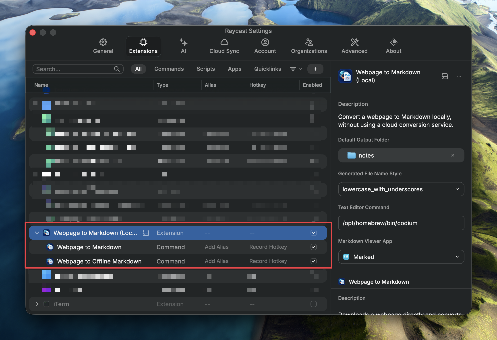
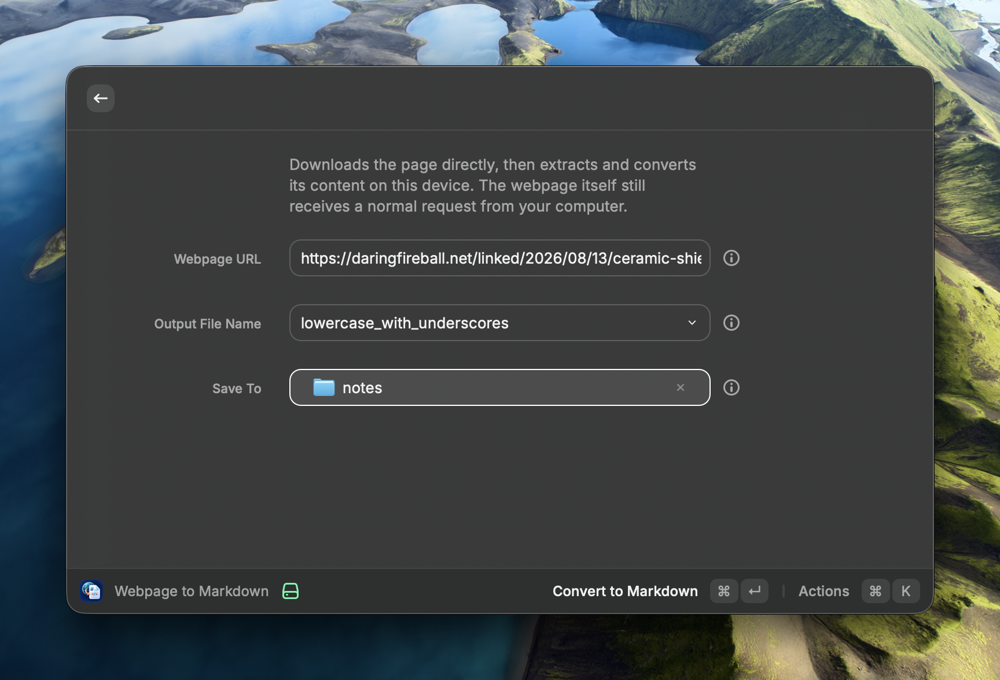
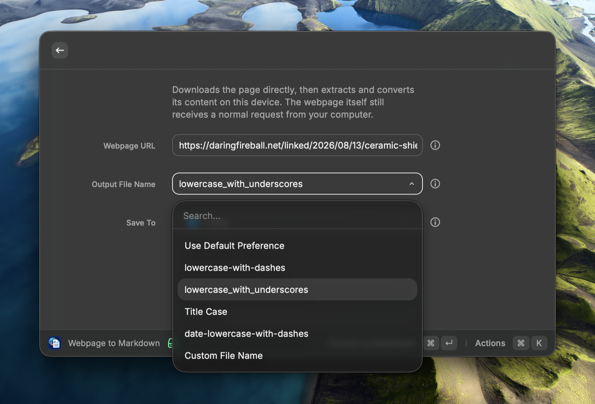
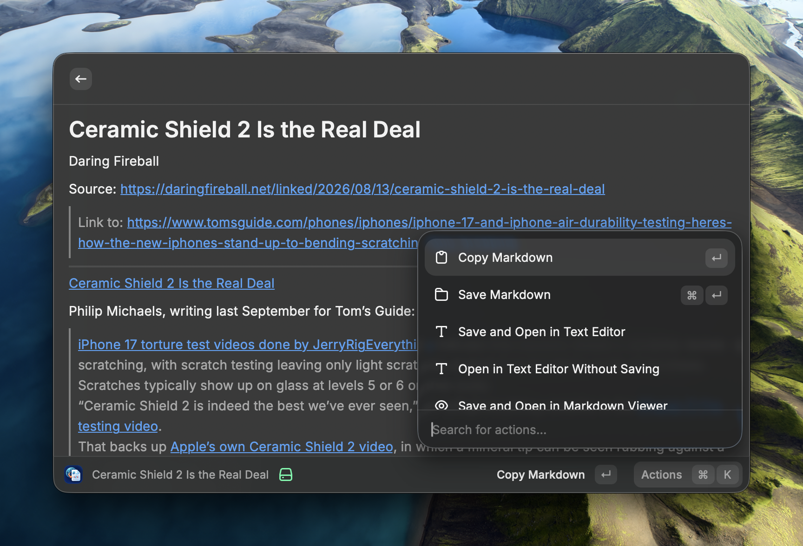
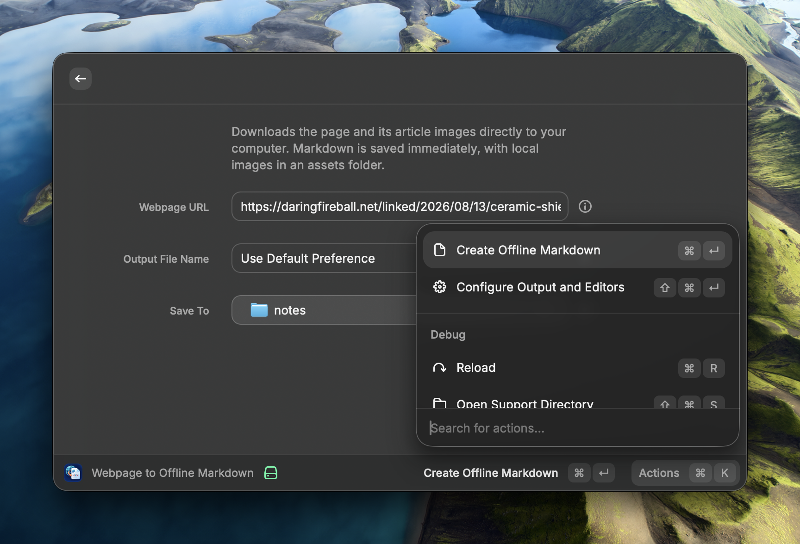

# Extension configuration and development

This directory is the Raycast extension package. For the project overview, commands, and offline export behavior, return to the [main README](../README.md).

## Configure Raycast preferences

Open the extension preferences in Raycast to configure output and application defaults.

<p align="center">
  
</p>

| Preference | Purpose |
| --- | --- |
| **Default Output Folder** | Used when a command does not choose a destination. Defaults to Downloads. |
| **Generated File Name Style** | Used when Output File Name is set to **Use Default Preference**. Supports lowercase dashes, lowercase underscores, Title Case, and date-prefixed lowercase dashes. |
| **Text Editor Command** | The command to open Markdown in an editor, for example `/opt/homebrew/bin/codium`. |
| **Markdown Viewer App** | A macOS app for rendering Markdown. |

Editor and viewer actions require their corresponding preference. They do not read shell environment variables.

## Convert the current Safari tab

**Current Safari Page to Markdown** reads the rendered HTML from Safari's active tab, so it can convert a webpage that is available only through your existing Safari sign-in. It uses the same local conversion and output controls as the normal command; it does not read, copy, or save Safari cookies.

Before using it, enable **Safari Settings > Developer > Allow JavaScript from Apple Events**. The first run may also ask you to allow macOS automation of Safari. This command is macOS-only and cannot convert Safari internal pages or other non-HTTP URLs.

## Choose output names and folders

The command form lets you choose a filename style for that run or select **Custom File Name**, which reveals a text field. The `.md` extension is optional and repeated extensions are removed. **Save To** overrides the default output folder for the current run only.

<p align="center">
  
</p>

<p align="center">
  
</p>

For offline exports, the selected folder receives a new folder named after the Markdown file; that folder contains the Markdown file and, when needed, `assets/`.

## Use the result actions

The regular conversion command opens a Markdown preview in Raycast. Its Action Panel can copy the Markdown, save and reveal the Markdown file, save and open it in a configured text editor or viewer, or open a temporary file without adding a copy to the output folder.

<p align="center">
  
</p>

Offline exports save automatically. Their Action Panel includes the same opening and reveal actions for the already-saved document.

<p align="center">
  
</p>

## Develop locally

From this directory:

```sh
npm install
npm run dev
```

Raycast reloads the extension while development mode is running. Before sharing a build, run:

```sh
npm run lint
npm run build
```

The repository root also provides `../dev_install_extension.sh` and `../install_extension.sh` helpers.

## Implementation notes

- The URL and offline commands fetch directly from the Mac running Raycast; pages that require a browser sign-in may not work.
- The Safari command reads the current Safari tab instead of fetching the URL again, but requires Safari's JavaScript-from-Apple-Events setting and macOS automation permission.
- Mozilla Readability extracts article content and Turndown converts it to Markdown.
- Offline image downloads are limited to 20 MB per image. The `assets` directory is created only after an image successfully downloads.
- Downloaded images use local relative paths and do not retain online image-link wrappers.
